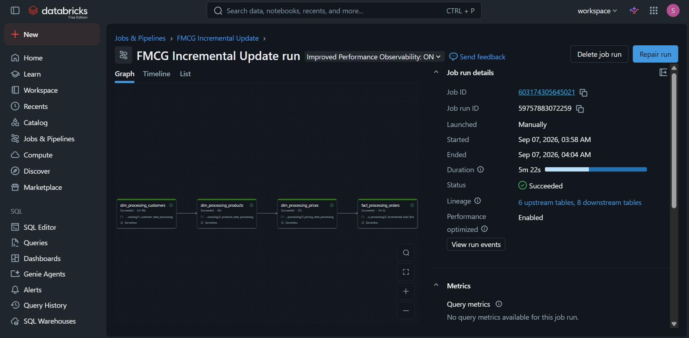
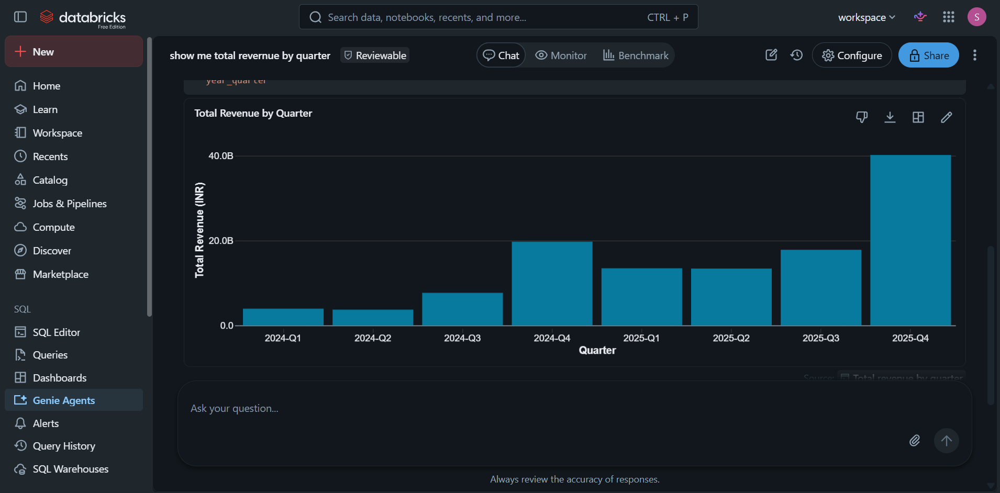
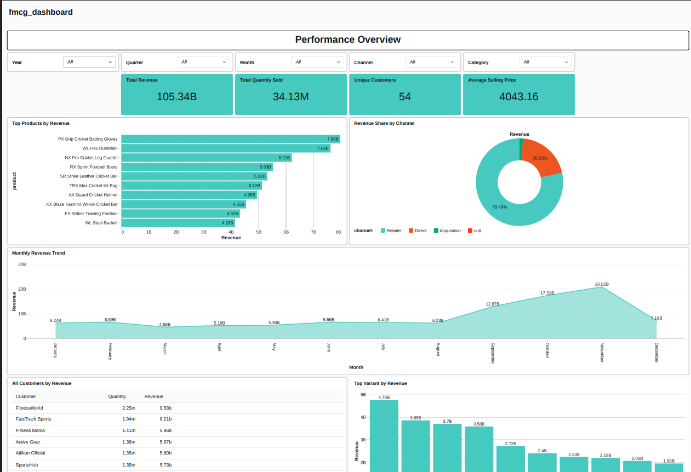
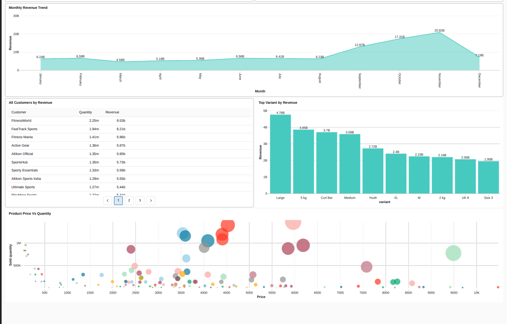

# AtliQ DataFusion

An end-to-end **FMCG Data Engineering project** built using Databricks, PySpark, SQL, Delta Lake and Amazon S3.

## 📌 Project Overview

**AtliQ DataFusion** is a Lakehouse project designed to integrate data from the parent company **AtliQ** and its acquired company **SportsBar**.

The project transforms raw business data into clean, reliable and analytics-ready datasets using the **Medallion Architecture**.

## 🏗️ Project Architecture


### Data Flow

**Source Data → Amazon S3 → Bronze → Silver → Gold → Dashboards & Analytics**

The pipeline processes data through three main layers:

- 🥉 **Bronze** – Raw ingested data
- 🥈 **Silver** – Cleaned and transformed data
- 🥇 **Gold** – Business-ready data for analytics

## 🥉 Bronze Layer

The Bronze layer stores raw data from Amazon S3 with minimal transformations.

Main activities:

- Ingest CSV files from Amazon S3
- Add file metadata
- Add ingestion/read timestamps
- Store data as Delta tables

## 🥈 Silver Layer

The Silver layer cleans and prepares the data for business use.

Main transformations include:

- Data cleaning
- Data type conversion
- Handling missing values
- Removing duplicates
- Standardizing columns
- Applying required transformations

## 🥇 Gold Layer

The Gold layer contains business-ready **fact and dimension tables**.

It is used for:

- Sales analysis
- Order analysis
- Customer analysis
- Product analysis
- Pricing analysis
- Business KPIs

The parent company and SportsBar data are integrated to create a unified analytics layer.

## ⚙️ Technologies Used

| Technology | Purpose |
|---|---|
| Python | Programming |
| PySpark | Data processing |
| SQL | Data transformation & analysis |
| Databricks | Lakehouse & ETL |
| Delta Lake | Data storage |
| Amazon S3 | Cloud storage |
| Lakeflow Jobs | Pipeline orchestration |
| Databricks Dashboards | Visualization |
| Genie | Natural-language analytics |

## 🔄 Pipeline Orchestration

The data processing workflow is automated using **Databricks Lakeflow Jobs**.



The jobs execute different processing tasks in the required order, helping automate the movement of data from Bronze to Silver and then Gold.

## 📊 Dashboards

The Gold layer is used to create dashboards for business analysis.

Key areas include:

- Sales performance
- Product performance
- Customer analysis
- Pricing analysis
- Business KPIs

### Dashboard 1



### Dashboard 2



### Dashboard 3



## 📁 Project Structure

```text
AtliQ-DataFusion/
│
├── 0_data/                  # Source datasets
├── 1_codes/                 # Databricks notebooks & ETL code
├── 2_dashboarding/          # Dashboard files
├── Photos/                   # Project screenshots
│   ├── Dashboard_2.png
│   ├── Dashboard_3.png
│   ├── Dashboard_4.png
│   ├── Orchestration_1.png
│   └── project_architecture.png
│
└── resources/               # Project resources
```

## 🎯 Project Objectives

- Build an end-to-end Data Engineering pipeline
- Implement Medallion Architecture
- Integrate AtliQ and SportsBar data
- Perform ETL using PySpark and SQL
- Use Delta Lake for reliable data storage
- Use Amazon S3 for cloud storage
- Automate pipelines using Lakeflow Jobs
- Build analytics-ready Gold tables
- Create business dashboards

## 👨‍💻 Author

**Sahil Chaurasia**

Data Engineering | PySpark | SQL | Databricks | AWS
